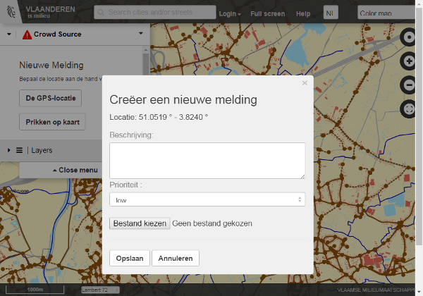

# eenvplus-geoloket  

Based on [mf-geoadmin3](https://github.com/geoadmin/mf-geoadmin3), this application allows Flemish cities to edit their sewer network.
This version includes the integration of the gsc-crowdsource service.

## Key differences with mf-geoadmin3

- Tailored to the Flemish region
- Limited scope of the viewer: for the time being only layers pertaining to the Flemish sewer system are available
- Enhanced editing features:
    - editing only allowed for authenticated users
    - advanced drawing tools to create and modify sewers and appurtenances
    - editing feature metadata
    - advanced validation of the modifications made to the sewer network
    - upload of [INSPIRE](http://inspire.ec.europa.eu/) compliant GML files
- A cross-platform build chain using [Grunt](http://gruntjs.com/)
- This version includes the integration of the gsc-crowdsource service.

**A sample sewer network editing session:**

[]

**A sample creating a crowdsourcing event**

[]

## Installation of all Components and Dependencies

See [INSTALL_GUIDE.md](INSTALL_GUIDE.md)

## Server side code:

See [eenvplus-sdi](https://github.com/VlaamseMilieumaatschappij/eenvplus-sdi)
